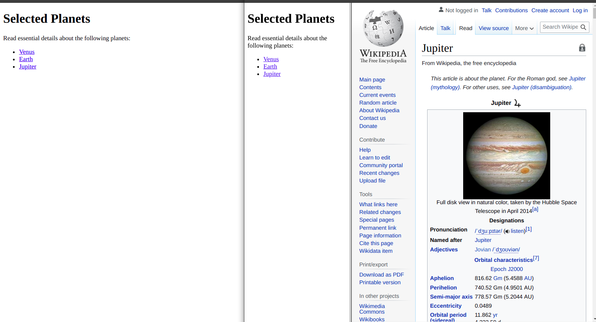

# Assignment 2

<B>  Name : Shivanshu</B><br>
<B>  Roll : 60 </B><br>

# ques 1
```html
<!DOCTYPE html>
<html lang="en">

<head>
    <meta charset="UTF-8">
    <meta http-equiv="X-UA-Compatible" content="IE=edge">
    <meta name="viewport" content="width=device-width, initial-scale=1.0">
    <title>1</title>
</head>

<body>
    <table border="1">
        <thead>
            <tr>
                <th rowspan="3">Day</th>
                <th colspan="3">Seminar</th>
            </tr>
            <tr>
                <th colspan="2">Schedule</th>
                <th rowspan="2">Title</th>
            </tr>
            <tr>
                <th>Begin</th>
                <th>End</th>
            </tr>
        </thead>
        <tbody>
            <tr>
                <td rowspan="2">Monday</td>
                <td rowspan="2">8:00 a.m.</td>
                <td rowspan="2">5:00 p.m.</td>
                <td>Introduction to XML</td>
            </tr>
            <tr>
                <td>Validity: DTD and Relax NG</td>
            </tr>
            <tr>
                <td rowspan="6">Tuesday</td>
                <td rowspan="2">8:00 a.m.</td>
                <td rowspan="2">11:00 a.m.</td>
                <td rowspan="3">XPath</td>
            </tr>
            <tr>
            </tr>
            <tr>
                <td rowspan="2">11:00 a.m.</td>
                <td rowspan="2">2:00 p.m.</td>
            </tr>
            <tr>
                <td rowspan="3">XSL Transformations</td>
            </tr>
            <tr>
                <td rowspan="2">2:00 p.m.</td>
                <td rowspan="2">5:00 p.m.</td>
            </tr>
            <tr>
            </tr>
            <tr>
                <td>Wednesday</td>
                <td>8:00 a.m.</td>
                <td>12:00 p.m.</td>
                <td>XSL Formatting objects</td>
            </tr>
        </tbody>
    </table>
</body>

</html>

```
<div style="page-break-after: always"></div>


<div style="page-break-after: always"></div>

## Ques 2 
```html
<!DOCTYPE HTML PUBLIC "-//W3C//DTD HTML 4.01//EN" "http://www.w3.org/TR/html4/strict.dtd">

<html>

<head>
    <meta charset="UTF-8">
    <title>2</title>
</head>

<frameset cols="30%,*">
    <frame name="main" src="88.html" />
    <frame name="side" src="https://en.wikipedia.org/wiki/Jupiter" />
    <noframes>

        <body>Your browser does not support frames.</body>
    </noframes>
</frameset>

</html>
```

```html
<!DOCTYPE HTML PUBLIC "-//W3C//DTD HTML 4.01//EN" "http://www.w3.org/TR/html4/strict.dtd">
<html lang="en">

<head>
    <meta charset="UTF-8">
    <title>2</title>
</head>

<body>
    <h1> Selected Planets </h1>
    <p> Read essential details about the following planets: </p>
    <ul>
        <li><a href="https://en.wikipedia.org/wiki/Venus" target="side">Venus</li>
        <li><a href="https://en.wikipedia.org/wiki/Earth" target="side">Earth</li>
        <li><a href="https://en.wikipedia.org/wiki/Jupiter" target="side">Jupiter</li>
    </ul>
</body>

</html>

```
<div style="page-break-after: always"></div>

